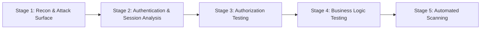
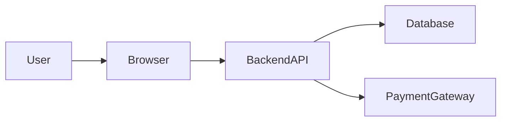

# Introduction
This repository outlines the structured approach I use when testing web applications for security vulnerabilities.
The methodology focuses on progressively understanding the application's attack surface, authentication model, authorization logic, and business workflows before attempting exploitation.
Rather than relying solely on automated tools, the goal is to build a clear understanding of how trust boundaries are implemented within the system.

## Stage 1 — Reconnaissance & Attack Surface Mapping
The first step is to understand what parts of the system are exposed and accessible from an external perspective.
This stage focuses on identifying the application's attack surface before interacting with its internal functionality.

Typical areas analyzed include:

* Subdomains and exposed services  
* Server technologies and frameworks  
* CDN and infrastructure presence  
* API endpoints  
* Public assets and JavaScript files  
* robots.txt and sitemap files  
* Publicly accessible administrative paths  
* Third-party integrations

Some of the tools used during this stage are:

* subfinder  
* httpx  
* Browser developer tools
* dig  
* nmap

Emphasis is always placed on understanding the system and identifying trust boundaries rather than relying solely on automated tools.

## Stage 2 — Authentication & Session Analysis
Once the attack surface is understood, the next step is to analyze how the application manages identity and sessions.
This stage involves observing how users authenticate and how session state is maintained across requests.

Areas typically tested includes:

* Login workflow behavior  
* Token generation and structure  
* Session lifetime  
* Logout behavior  
* Token reuse across devices  
* Session storage mechanisms (cookies, localStorage, headers)

## Stage 3 — Authorization Testing
After authentication behavior is understood, authorization logic is tested to determine if users can access resources or actions outside their permissions.

Typical tests:

* Accessing resources belonging to other users (IDOR)
* Manipulating identifiers in requests
* Accessing restricted endpoints
* Role-based privilege escalation attempts

## Stage 4 — Business Logic Testing
This stage focuses on identifying flaws in the application's workflow logic.
Instead of targeting individual vulnerabilities, the goal is to understand how the system expects processes to occur and then test if those assumptions can be broken.

Typical areas tested:

* Checkout and payment workflows
* Order manipulation
* Coupon or discount abuse
* Inventory manipulation
* Workflow sequencing issues, etc.

## Stage 5 — Automated Security Scanning
After manual testing has identified the application's key workflows and trust boundaries, automated scanning tools can be used to identify additional issues like known vulnerabilities or configuration problems.

Typical tools:

* Nuclei  
* OWASP ZAP  
* Burp Scanner  
* Dependency scanners

## Key Principle
Understanding how an application is designed to function internally is often more valuable than simply running automated tools.
Many impactful vulnerabilities arise from broken assumptions in system design rather than individual technical flaws.

## Core Testing Philosophy
Security testing is most effective when the tester understands how the application is intended to function.
Rather than immediately searching for vulnerabilities, the objective is first to identify trust boundaries, data flows, and assumptions made by the system.
Vulnerabilities often arise when these assumptions can be broken.
